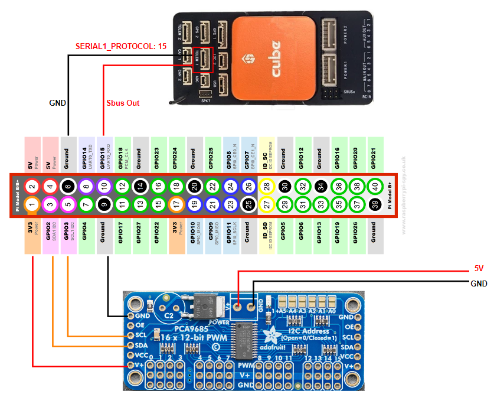
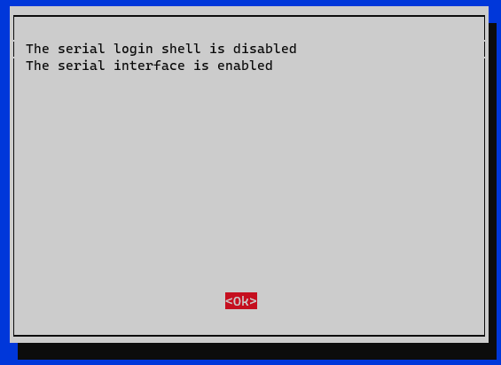

# Raspberry Pi with PCA9685 and SBus Protocol

## Hardware
This project using hardware:
- [CM4-NANO-B](https://www.waveshare.com/wiki/CM4-NANO-B)
- [Raspberry Pi 4](https://www.proe.vn/cm4-2gb-ram-32gb-emmc-wireless)
- [PCA9685](https://www.adafruit.com/product/815)
- [Cube Orange Flight Controller](https://docs.px4.io/main/en/flight_controller/cubepilot_cube_orange.html)

## Features
- Using `I2C` to communicate with PCA9685
- Using `built-in UART` to read [sbus](https://github.com/bolderflight/sbus)

## Raspberry Pi Setup
### Enable I2C Interface
- `sudo raspi-config`
- `Interface Options` -> `I2C` -> `Enable`
### To use built-in UART
- `sudo raspi-config`
- `Interface Options` -> `Serial Port`\
Login Shell: Disable \
Serial Interface: Enable


- `sudo systemctl disable hciuart`
- add `dtoverlay=disable-bt` to `/boot/config.txt`
- reboot and use `/dev/ttyAMA0`

## Getting started
This document asumes that you have already configured network/wifi connectivity on your Raspberry Pi.

```
$ sudo apt update && sudo apt upgrade
$ sudo apt-get install git
```

### Install WiringPi
```
$ git clone https://github.com/WiringPi/WiringPi.git
$ cd WiringPi
$ ./build
```

### Install Project
```
$ git clone https://github.com/VinhTr00/raspberry-with-pca9685-sbus.git
$ cd raspberry-with-pca9685
$ make
```

### How to run
```
$ ./build/main
```

## Reference
- [Raspberry-sbus](https://github.com/Carbon225/raspberry-sbus)
- [STM32-HAL-PCA9685](https://github.com/henriheimann/stm32-hal-pca9685)

